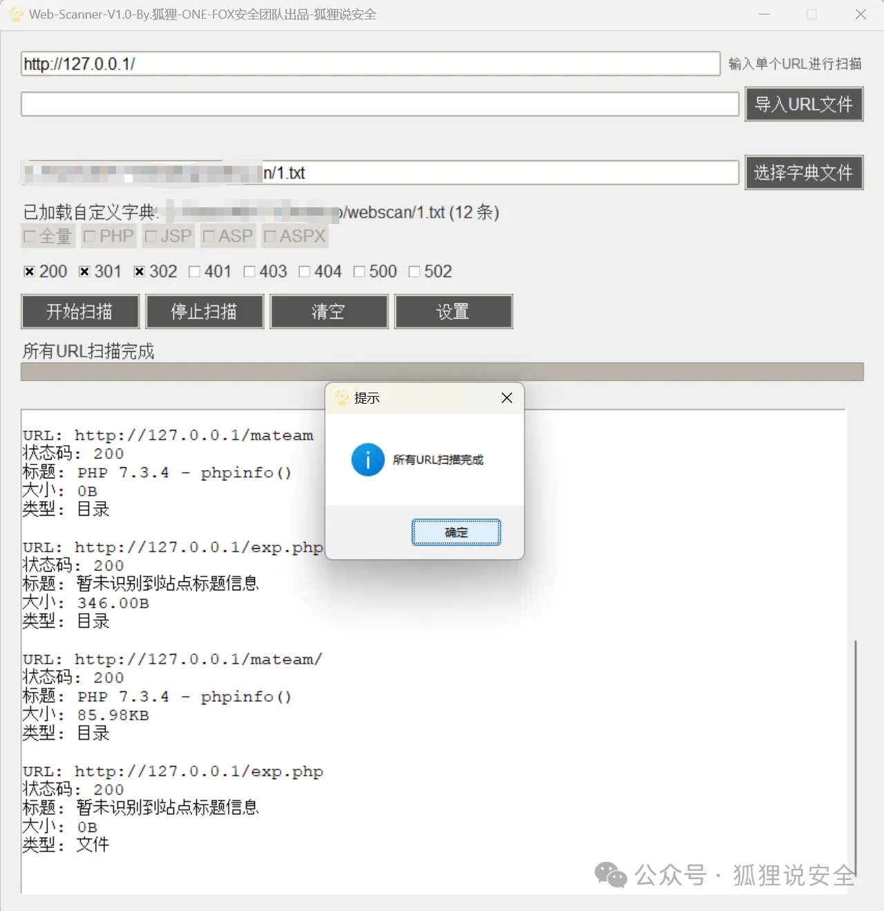

# :fox_face:One-Fox-T00ls

###  One-Fox-T00ls

<br/>
  <p align="center">
    <a href="https://www.one-fox.cn/">
      
    </a>
    
    
    <a href="https://github.com/One-Fox-Security-Team/One-Fox-T00ls/issues"></a>
</p>
<br/>

## :triangular_flag_on_post:简介
为了在渗透测试过程中更好的方便的去测试，而不是为了配置环境，浪费很多时间，此项目就应运而生
<br/>信息收集
<br/>web渗透
<br/>免杀
<br/>后渗透
<br/>权限维持
<br/>包含了红蓝攻防大部分必须使用工具


## :hammer_and_pick:T00ls
| 工具名             | 运行系统      | 依赖环境 | 推荐指数                                                     | 备注                     | 下载地址                                                     |
| ------------------ | ------------- | -------- | ------------------------------------------------------------ | ------------------------ | ------------------------------------------------------------ |
| FoxBypass_V1.0 | :window:	 | python | :star: :star: :star: :star: :star: :star: :star: :star::star:|   分离免杀加载器工具   | <a href="https://pan.quark.cn/s/6b625a91b80b">链接</a> |
| Web-Scanner | :window:	       | Windows   | :star: :star: :star: :star: :star: :star: :star: :star::star: | WEB目录探测工具         |<a href="https://pan.quark.cn/s/c31b0b332cd6">链接</a>  |
| One-Fox-T00ls-v8.0 | :window:	       | python   | :star: :star: :star: :star: :star: :star: :star: :star::star: | 推荐使用8.0版本         |<a href="https://mp.weixin.qq.com/s/vvx9b9J9rv4KBah0t30xKA">链接</a>  |
| 应急响应工具箱     | :window:	       | 无       | :star: :star: :star: :star: :star: :star: :star: :star:      | 适合新手直接使用         | <a href="https://pan.baidu.com/s/1aLe78CmKu61-f7H5lZgdBg?pwd=ofox">链接</a> |
| 贺岁工具箱         | :window:	       | 无       | :star: :star: :star: :star: :star: :star: :star: :star:      | 需要关注公众号获取授权码 | <a href="https://pan.baidu.com/s/1HsHU-JuEfIs--7ZuYLYFmw?pwd=ofox">链接</a> |
| 原创工具箱V1.2     | :window:	       | 无       | :star: :star: :star: :star: :star: :star: :star: :star:      | 适合新手直接使用         | <a href="https://pan.baidu.com/s/1z26Wyki0ZNEwp2YN-Flk8Q?pwd=ofox">链接</a> |
| ONE-FOX单兵武器库v3.0  | 虚拟机        | 虚拟机   | :star: :star: :star: :star: :star: :star: :star: :star:      | 需要安装虚拟机           | <a href="https://pan.baidu.com/s/1D4jOaQHM7LUfFgrso5IhKA?pwd=ofox">链接</a> |
| HackerPermKeeper   | :window:	/linux | python | :star: :star: :star: :star: :star: :star:                    | linux后渗透权限维持      | <a href="https://github.com/RuoJi6/HackerPermKeeper">链接</a> |
| One-Fox-T00ls-v5.0 | :window:	 | python | :star: :star: :star: :star: :star: :star: :star: :star::star:| 适合新手直接使用     | <a href="https://pan.baidu.com/s/1ZKuGpSqH2kL57Er84gouaw?pwd=ofox">链接</a> |


<br/>

## :warning:安全申明
工具申明
使用此系统即自动同意武器库系统下载链接里面的免责声明内提到的条款与声明，不同意武器库系统下载链接里面的免责声明内提到的条款与声明的请自行删除此武器库系统，否则一切后果责任均自负，最终解释权归One-Fox安全团队与狐狸说安全微信公众号所有。
<br/><br/>
所使用的工具资源均来自于网友投稿及互联网整理，作者仅提供分享交流平台，不为其版权负责。如果您发现本镜像中有侵犯您（或贵司）知识产权的资源，请及时反馈，作者会第一时间进行修改或删除。

<br/>


## :rocket:工具截图
<details>
<summary><b>:yum:FoxBypass</b></summary>

```
FoxBypass
```


</details>


<details>
<summary><b>:yum:Web-Scanner</b></summary>

```
Web-Scanner
```



</details>


<details>
<summary><b>:yum:One-Fox-T00ls-v8.0</b></summary>

```
One-Fox-T00ls-v8.0 
```


</details>

<details>
<summary><b>:stuck_out_tongue:应急响应工具箱</b></summary>

```
应急响应工具箱
```

</details>

<details>
<summary><b>:stuck_out_tongue_winking_eye:贺岁工具箱</b></summary>

```
贺岁工具箱
```

</details>

<details>
<summary><b>:stuck_out_tongue_closed_eyes:原创工具箱V1.2</b></summary>

```
原创工具箱V1.2
```

</details>


<details>
<summary><b>:hugs:ONE-FOX单兵武器库v3.0</b></summary>

```
ONE-FOX单兵武器库
```

</details>

<details>
<summary><b>:shushing_face:HackerPermKeeper</b></summary>

```
HackerPermKeeper
```

</details>

<details>
<summary><b>:yum:One-Fox-T00ls-v5.0</b></summary>

```
One-Fox-T00ls-v5.0
```

</details>

<br/>

## :zap:提交问题
有问题请提交issues<br/>
<a href="https://github.com/One-Fox-Security-Team/One-Fox-T00ls/issues"></a>
<br/>
关注微信公众号进入微信群聊[关注之后右下角点击联系我们加入群聊]
<br/>
<br/>

<br/><br/>

## :world_map:贡献者名单
琴，弱鸡，闲客，听雨，懒居，中二，好人，柚屿，雨夜，LonelyBoy，天赐福报，狐狸等师傅以及Github和众多开源项目师傅们的倾力支持。（排名不分先后顺序）

<br/>

## :star2:Stargazers over time [](https://starchart.cc/One-Fox-Security-Team/One-Fox-T00ls)

<a href="https://github.com/One-Fox-Security-Team">
  
</a>

